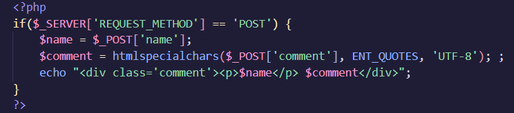

    This lab is about HTML Injection(XSS):

- This vulnerabitity happening by adding html tags into website.

- Mostly this vulnerabitity will run JS code in your website because JS is flexible and it has many ways to exploit, this is some examples:
   
   (remove . for payload)
   
- Many ways to bypass XSS, in case they block script tag, you can use (remove . for payload) or if they remove script tag you can use this trick: <scrscriptipt.>(remove .) js-code here </scrscriptipt.>(remove .). (After they remove script tag, this whill be payload:  )
-> Depend on your creative, research ability and experience.

- In this labs, this is my basic php code for xss vul:
    
    

- Look at this code you can see that i have filltered $comment by htmlspecialchars(filltered function of php): $comment = htmlspecialchars($_POST['comment'], ENT_QUOTES, 'UTF-8'); 
-> So you can't xss that.

- But i hadn't filltered $name. Easiest ways is use script tag: 

-> RESULT:

- Some of effective ways to against XSS include using Content Security Policy (CSP) to restrict script sources.
- CSP can be deployed via HTTP header or <meta> card, such as:
    + <meta http-equiv="Content-Security-Policy" content="default-src 'self'; script-src 'self'; style-src 'self';".>(remove .)
    + Header in nginx: add_header Content-Security-Policy "default-src 'self'; script-src 'self'; style-src 'self';";
    + Header in Apache: Header set Content-Security-Policy "default-src 'self'; script-src 'self'; style-src 'self';"